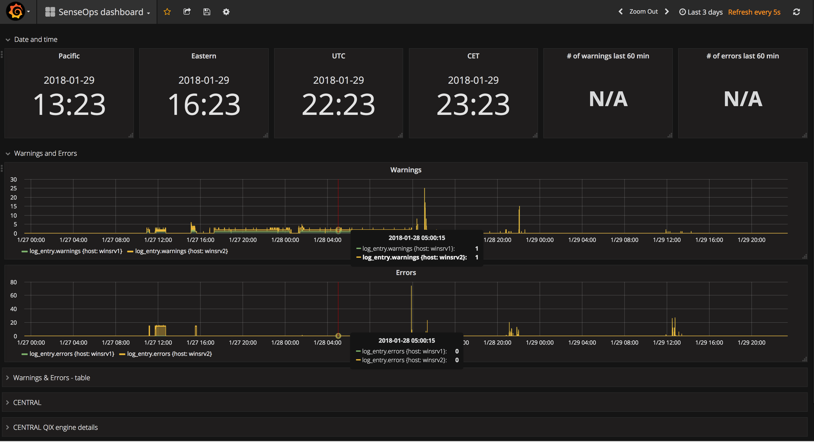
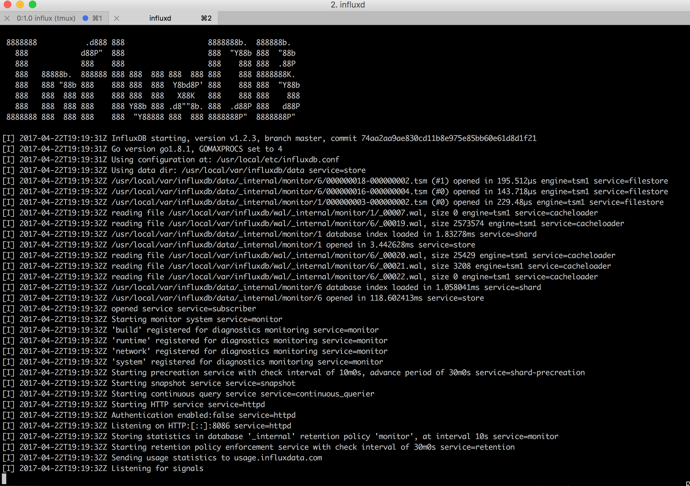
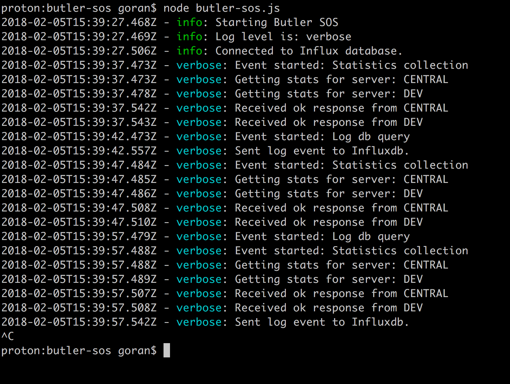

  

  
# Butler SOS v2
Butler SenseOps Stats ("Butler SOS") is a Node.js service publishing operational Qlik Sense Enterprise metrics to MQTT and Influxdb.  
It uses the [Sense healthcheck API](http://help.qlik.com/en-US/sense-developer/November2017/Subsystems/EngineAPI/Content/GettingSystemInformation/HealthCheckStatus.htm) to gather operational metrics for the Sense servers specified in the YAML config file.  
It also pulls warnings and errors from [Sense's Postgres logging database](http://help.qlik.com/en-US/sense/November2017/Subsystems/PlanningQlikSenseDeployments/Content/Deployment/Qlik-Logging-Service.htm), and forwards these to Influx and MQTT.

**Why a separate tool for this?**  
Good question. While Qlik Sense ships with a great Operations Monitor application, it is useful for real-time operational monitoring.  
It is great for retrospective analysis of what happened in a Qlik Sense environment, but for a real-time view into a Sense environment, something else is needed - enter Butler SOS.

The most interesting use of Butler SOS is probably to create real-time dashboards based on the data in the Influx database, showing operational metrics for a Qlik Sense Enterprise environment.  
A fully interactive demo dashboard is available [here](https://snapshot.raintank.io/dashboard/snapshot/1hNwAmi50lykKYXr6mswhKmll9myrH20?orgId=2).  
  
Sample screen shots:

  
  

Butler SOS can however also send the data to [MQTT](https://en.wikipedia.org/wiki/MQTT), for use in any MQTT enabled tool or system.

## What's new
Updates and new features in v2: 

* Close to real-time metrics on warnings and errors appearing in the QLik Sense logs
* Improved posting of data to MQTT 
* YAML config files instead of JSON
* New and more comprehensive sample Grafana dashboards
* A [demo dashboard](https://snapshot.raintank.io/dashboard/snapshot/1hNwAmi50lykKYXr6mswhKmll9myrH20?orgId=2) that anyone can try out

## Install and setup
* Butler SOS v2 has been developed with Qlik Sense Enterprise November 2017 in mind. In order to use Butler SOS with other Sense versions, some adaptations may be needed.
* Clone [the repository](https://github.com/ptarmiganlabs/butler-sos) from GitHub to desired location.  
* Make sure [Node.js](https://nodejs.org) is installed. Butler-SOS has been tested with Node.js 8.9.4. 
* Run "npm install" from within the main butler-sos directory to download and install all Node.js dependencies.
* Make a copy of the [config/default_template.yaml](https://github.com/ptarmiganlabs/butler-sos/blob/master/config/default_template.yaml) configuration file. Edit the file as needed, save it as "default.yaml" in the ./config directory.
Butler SOS will read its config settings from this file.
* [Export certificates](http://help.qlik.com/en-US/sense/November2017/Subsystems/ManagementConsole/Content/export-certificates.htm) from Qlik Sense QMC, then place them in the ./cert folder under Butler SOS' main folder.
* Install [Influxdb](https://docs.influxdata.com/influxdb/v1.4/introduction) (only needed if data is to be stored in Influxdb, of course).
* Install [Mosquitto](https://mosquitto.org) or another MQTT broker (only needed if data is to be forwarded to MQTT). If you already have an MQTT broker you do not need to install a new one, Butler SOS can use the existing broker.

### Configuration files
The latst version of Butler SOS introduce several breaking changes to its configuration file:

* The configuration file format is now YAML rather than JSON. YAML is a more human readable and compact file format compared to JSON. It also allows comments to be used.  
* Virtual proxies are no longer used to get the Sense healthcheck data.  
Instead of virtual proxies the main Qlik Sense Engine Service (QES) is called on TCP port 4747  to get the health data of each Sense server that should be monitored.   
A consequency of this is that certificates are now used to authenticate with Qlik Sense, rather than the security-by-obscurity that was the most commonly used security solution in the past for Butler SOS.
Please note that the path to these certificates must be properly configured in the config file's Butler-SOS.cert section. 

Pleae refer to the conig/default.yaml for further configuration instructions.

### Postgres log database
The config file allows you to set how often Butler should query the Sense log database for warnings and errors. In order to get real-time (-ish) notifications of warnings and errors, you should set the polling frequency to a reasonably low level. On the other hand, this polling will consume server resources and put some load on the Sense logging database - i.e. you should not set a too low polling frequency... 
Experience shows that polling every 15-30 seconds work well and doesn't put too much load on the database.
  
There is one caveat to be aware of when it comes to the Butler-SOS.logdb.pollingInterval setting:   
By default Butler SOS will query the log database for any warnings and errors that have occured during the last 2 minutes. The reason for having such a limit is simply to limit the query load on the Postgres server.  
This however also means that you should **not** configure a polling frequency of 2 minutes or more, as such a setting would mean that Butler SOS would not capture all warnings and errors.   
  
If you need a log database polling frequency longer than 2 minutes, you also need to change the SQL query in the butler-sos.js file to a longer time window.

## Usage 
Start Influxdb and Mosquitto (or other MQTT broker).   
Both Influxdb and Mosquitto should work right after installation - for production use their respective config files should be reviewed and edited as needed, with respect to use of https etc.

Starting Influxdb on OSX will look something like this (for Influx v1.2.3):

Then start Butler SOS itself from the main butler-sos directory:  
"node butler-sos.js".  
  
If the Influxdb database specified in the config file does not exist, it will be created.

Here we see how two servers are queried for data.  
The responses are retrived asyncronously as they arrive from the different servers.  
Finally, the data is stored to Influxdb and sent as MQTT messages.

### Installation cheat sheet
By popular request, here are the commands needed to install Influx and Grafana.  
The commands below assume you are using a Mac and have the [Homebrew](https://brew.sh/) package manager installed.  
You can also install the software on a Linux server (apt-get install ... on Debian etc). Windows might be possible, but it is usually easier to spin up a small Linux server in a Docker container on your Windows PC, compared to installing the actual software on Windows...   
Using Docker containers is actually a great way to play around with software, without clogging down your own computer. Butler SOS is in fact developed using Influx, Grafana and MQTT running in Docker containers.
  
Install and start Influx:  

    brew install influxdb
    influxd -config /usr/local/etc/influxdb.conf

Install and start Grafana

    brew install grafana
    brew services start grafana

Connect to Grafana by visiting http://localhost:3000
Default username/pwd is admin/admin.

## Real-time dashboards using Grafana
Once the data exists in Influxdb it can be visualised using [Grafana](https://grafana.com).
  
A sample dashboard is included in the Grafana directory. Import it into your Grafana environment, then modify it to reflect your server host names, after which it should show real-time metrics for your Sense servers.  
Grafana is extremely powerful. Creating automatically updating dashboards for any number of servers is a matter of a few minutes work. Tutorials and docs can be found on their site.

## References
  
Please see [https://ptarmiganlabs.com](https://ptarmiganlabs.com/blog/2017/04/24/butler-sos-real-time-server-stats-qlik-sense/) and [https://github.com/ptarmiganlabs/butler](https://github.com/ptarmiganlabs/butler) for more in-depth info on the Butler family of micro services for Qlik Sense.
  
At [https://senseops.rocks](https://senseops.rocks) you also find thoughts on using DevOps best practices in the Qlik Sense ecosystem.
